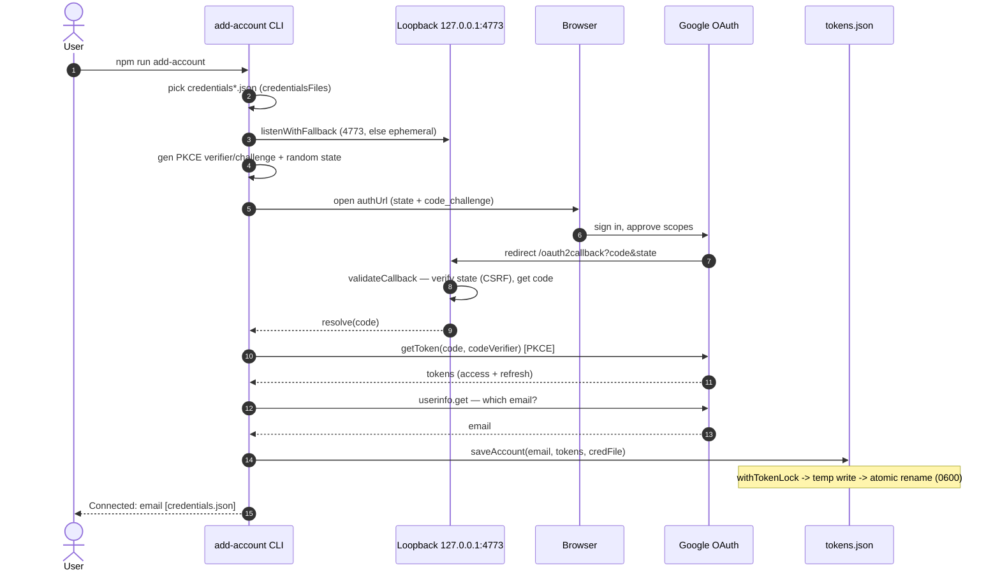
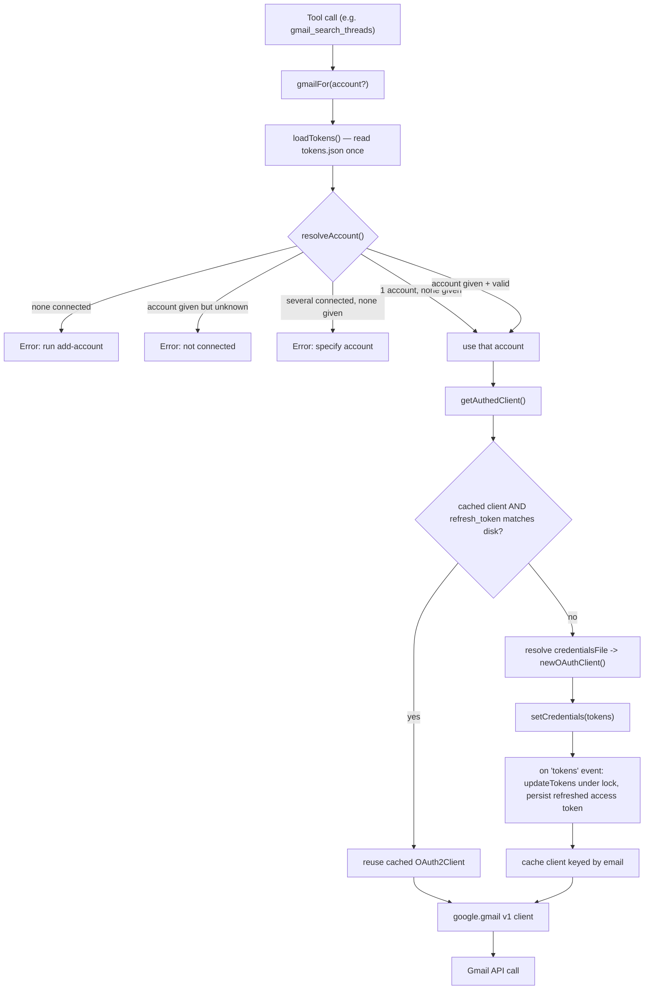
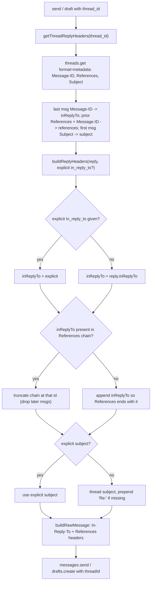

# Gmail MCP Server (multi-account)

A local [Model Context Protocol](https://modelcontextprotocol.io) server that lets Claude work with **multiple Gmail accounts** through one connector. Each tool takes an optional `account` parameter to choose which mailbox to act on. Authentication is per-account OAuth — every account does a one-time browser consent and its refresh token is stored locally.

This is the multi-account capability the built-in Google connector doesn't offer: the limit there is one Google account per connection, not a limit of MCP itself.

## Tools

| Tool | What it does |
| --- | --- |
| `gmail_list_accounts` | List connected account emails |
| `gmail_search_threads` | Search threads with Gmail query syntax |
| `gmail_get_thread` | Read a full thread (headers + plain-text bodies) |
| `gmail_get_message` | Read a single message by ID (for threads too large to return whole) |
| `gmail_create_draft` | Compose a draft (does not send); supports HTML body and attachments |
| `gmail_send_message` | Send an email immediately; supports HTML body and attachments |
| `gmail_list_labels` | List labels and their IDs |
| `gmail_create_label` | Create a user label |
| `gmail_modify_labels` | Add/remove labels on a thread or message (also mark read/unread, archive) |

Every tool except `gmail_list_accounts` accepts `account: "you@gmail.com"`. If only one account is connected, you can omit it; with several connected, it's required.

`gmail_search_threads` is paginated: each call returns up to `max_results` threads (≤100) plus a `next_page_token` when more match. Pass that token back as `page_token` (with the same query) to fetch the next page.

### HTML and attachments (send / draft)

`gmail_send_message` and `gmail_create_draft` accept:

- `is_html` (boolean): when true, `body` is sent as HTML instead of plain text.
- `attachments` (array): each item supplies **exactly one** of:
  - `path` — a local file the server reads from disk (filename and MIME type inferred if omitted). **Disabled by default**: reading by `path` only works when you set `GMAIL_MCP_ATTACHMENTS_DIR` to one or more allowed directories, and the file must resolve to within one of them (symlinks and `../` are resolved before the check). This prevents the server from being coerced into emailing arbitrary local files such as SSH keys or `.env`.
  - `content_base64` — inline standard-base64 content (`filename` required; MIME type inferred from it if omitted).

  Optional `mime_type` overrides the inferred type on either form. With attachments, the message is assembled as `multipart/mixed`. Non-ASCII subjects are RFC 2047-encoded; non-ASCII (or very long) filenames use RFC 2231 extended parameters (`filename*=UTF-8''…`, with continuation segments when long) — encoded-words are not legal inside MIME parameters.

## Prerequisites

- **Node.js ≥ 18.18** (20.x and 22.x also work and are covered by CI). Check with `node -v`; on macOS the easiest install is [Homebrew](https://brew.sh) — `brew install node`.
- **git**, to clone the repo and pull updates later.

Clone the project and work from its folder (the example names the folder `gmail-mcp-server`; any path works):

```bash
git clone https://github.com/uaixo/Claude-Custom-Gmail-MCP-Server-For-Multiple-Google-Accounts.git gmail-mcp-server
cd gmail-mcp-server
```

Every `npm run …` command below is run from this folder.

## One-time setup

### 1. Create a Google OAuth client

These steps are identical on Windows and Mac.

1. Go to the [Google Cloud Console](https://console.cloud.google.com/) and create (or pick) a project.
2. Enable the **Gmail API**: APIs & Services → Library → search "Gmail API" → Enable.
3. Configure the **OAuth consent screen** (APIs & Services → OAuth consent screen):
   - User type **External** → Create.
   - Fill in App name and your email for the support + developer contacts. Skip the rest.
   - Scopes can be left empty — the server requests them at sign-in time.
   - **Test users:** add every Gmail address you plan to connect. An unverified External app only works for listed test users.
   - Save, and leave it in "Testing" status (no need to publish).
4. Create credentials → **OAuth client ID** → application type **Desktop app** → Create.
5. Click **Download JSON** in the dialog.

> Note: this server uses a loopback redirect on `http://127.0.0.1:4773/oauth2callback` (with PKCE and a CSRF `state` check). The **Desktop app** client type allows loopback redirects automatically, so no extra redirect-URI configuration is needed. Don't pick "Web application."

### 2. Place the credentials

The server looks for `credentials.json` in `~/.gmail-mcp/` by default. The leading-dot folder is awkward to create in Finder/Explorer, so use the terminal:

**Mac (Terminal):**

```bash
mkdir -p ~/.gmail-mcp
mv ~/Downloads/client_secret_*.json ~/.gmail-mcp/credentials.json
```

→ ends up at `/Users/YOU/.gmail-mcp/credentials.json`

**Windows (PowerShell):**

```powershell
mkdir $HOME\.gmail-mcp
move $HOME\Downloads\client_secret_*.json $HOME\.gmail-mcp\credentials.json
```

→ ends up at `C:\Users\YOU\.gmail-mcp\credentials.json`

Or store it anywhere and point `GMAIL_OAUTH_CREDENTIALS` at the path.

#### Multiple OAuth clients (one per account)

If your Gmail accounts live under **different OAuth clients** — e.g. separate Google Cloud projects, each with its own `client_id` — save each client's JSON in the data dir as `credentials*.json`:

```
~/.gmail-mcp/credentials.json       # client for account A
~/.gmail-mcp/credentials2.json      # client for account B
~/.gmail-mcp/credentials-work.json  # client for account C
```

Any filename matching `credentials*.json` is auto-discovered. When you run `add-account` and more than one is present, it lists them and asks which to use. The account records which file authorized it, and **token refresh always uses that same file** — this matters because a refresh token only works with the OAuth client that issued it. Keep these files in place; don't rename or delete one that an account depends on.

If all your accounts are under a *single* OAuth client, ignore this — one `credentials.json` covers every account.

> Setting `GMAIL_OAUTH_CREDENTIALS` forces that single file and disables auto-discovery.

### One-command setup

Once `credentials.json` is in place (step 2 above), a single command installs dependencies, builds, and connects your first account:

```bash
npm run setup
```

This runs `npm install` → `npm run build` → `npm run add-account` in sequence; the last step opens a browser consent screen. To connect additional mailboxes afterwards, run `npm run add-account` again per account. The manual steps below are equivalent if you'd rather run them individually.

### 3. Install and build

Same commands on both platforms, run in the project folder:

```bash
npm install
npm run build
```

> Run `npm install` separately on each machine. Do **not** sync `node_modules/` (or `dist/`) between Windows and Mac via OneDrive/Dropbox — synced file locks corrupt the install. Both are already in `.gitignore`.

### 4. Connect accounts

Run once per Gmail account. Each opens a browser consent screen; sign in with the account you want to add.

```bash
npm run add-account
```

Repeat for each additional mailbox. If multiple `credentials*.json` files are present, you'll be prompted to choose which OAuth client to authorize with. Manage accounts with:

```bash
npm run list-accounts
npm run remove-account you@gmail.com
```

`list-accounts` shows each account alongside the credential file it uses, e.g. `you@gmail.com  [credentials.json]`.

Tokens are written to `~/.gmail-mcp/tokens.json` (permissions `600`), recording each account's tokens and which credential file authorized it. **Never commit this file or any `credentials*.json`.**

## Connect to Claude Desktop

Open the config via Claude Desktop → Settings → Developer → Edit Config, or edit it directly:

- **Mac:** `~/Library/Application Support/Claude/claude_desktop_config.json`
- **Windows:** `%APPDATA%\Claude\claude_desktop_config.json` (i.e. `C:\Users\YOU\AppData\Roaming\Claude\claude_desktop_config.json`)

Point `args` at the built `dist/index.js`.

**Mac:**

```json
{
  "mcpServers": {
    "gmail": {
      "command": "node",
      "args": ["/Users/YOU/path/to/GmailMCPServer/dist/index.js"]
    }
  }
}
```

**Windows** (JSON requires escaped backslashes, `\\`):

```json
{
  "mcpServers": {
    "gmail": {
      "command": "node",
      "args": ["C:\\Users\\YOU\\path\\to\\GmailMCPServer\\dist\\index.js"]
    }
  }
}
```

If you stored credentials/tokens somewhere non-default, pass the data dir through `env`:

```json
{
  "mcpServers": {
    "gmail": {
      "command": "node",
      "args": ["/absolute/path/to/GmailMCPServer/dist/index.js"],
      "env": {
        "GMAIL_MCP_DATA_DIR": "/custom/path/.gmail-mcp"
      }
    }
  }
}
```

Restart Claude Desktop. Ask it to "list my connected Gmail accounts" to confirm.

> **Node on PATH:** `"command": "node"` requires Node to be discoverable. Check with `node --version`. If it isn't found (more common on Windows), use the full path to the binary instead — find it with `which node` (Mac, typically `/usr/local/bin/node` or `/opt/homebrew/bin/node`) or `where node` (Windows, typically `C:\\Program Files\\nodejs\\node.exe`).

## Updating

`dist/` and `node_modules/` aren't committed (they're built locally), so after pulling new code, reinstall and rebuild:

```bash
cd gmail-mcp-server   # your clone
git pull
npm install
npm run build
```

Then restart Claude Desktop. Your connected accounts persist across updates — `~/.gmail-mcp/` (tokens and credentials) is never touched by an update.

## Notes

- **Scopes (minimal):** `gmail.modify` (read + labels + drafts), `gmail.send` (send), `userinfo.email` (to identify the account). `gmail.compose` is intentionally not requested — its abilities are already covered by the other two. Drop `gmail.send` from `src/constants.ts` and re-consent if you want a send-disabled, draft-only setup.
- **Body format:** send/draft take a single `body` plus an `is_html` flag (plain text by default). When `is_html` is true the message is sent as `multipart/alternative` — the HTML plus an auto-derived plain-text part (via `html-to-text`) so clients that don't render HTML still get readable text.
- **Recipients:** `to`/`cc`/`bcc` accept either a bare address (`alice@x.com`) or a display-name form (`Alice Example <alice@x.com>`).
- **Transient errors:** Gmail calls are retried automatically with bounded, jittered backoff, and each request has a timeout (`GMAIL_MCP_REQUEST_TIMEOUT_MS`, default 30s) so a stalled socket fails fast instead of hanging. Read/label operations retry on rate limits (429), transient server errors (5xx), and transport failures (timeout/connection reset). Sending and draft creation retry **only on 429** (a rejected-before-processing rate limit) so a transient 5xx — or a timeout that may actually have been delivered — can't produce a duplicate; other failures surface immediately.
- **Attachments:** supplied per call via local `path` or inline `content_base64`. Reading by `path` is disabled unless `GMAIL_MCP_ATTACHMENTS_DIR` allowlists the directory it lives in (a guardrail against emailing arbitrary local files); inline base64 is impractical for large binaries the model can't see, so set the allowlist and use `path` for those. Gmail's total message size limit (~25 MB) applies.
- **Local-only:** this runs over stdio on your machine; tokens never leave it. To expose it as a *remote* custom connector instead, swap the stdio transport for the streamable-HTTP transport, host it on the public internet over HTTPS, and add it in Claude under Settings → Connectors → Add custom connector.
- **Token expiry:** access tokens refresh automatically. If a refresh token is revoked (password change, manual revocation, or long inactivity on an unverified app), re-run `npm run add-account` for that account. A running server detects the rewritten credentials and picks them up on its next call — no restart needed.
- **Multiple OAuth clients:** drop several `credentials*.json` files in the data dir; each account records which one authorized it and refreshes with that same client. Don't remove a credential file an account still depends on (the server returns an actionable error if it's missing). Legacy `tokens.json` files from before this feature are migrated automatically and assumed to use `credentials.json`.

## Environment variables

| Variable | Default | Purpose |
| --- | --- | --- |
| `GMAIL_MCP_DATA_DIR` | `~/.gmail-mcp` | Where tokens and `credentials*.json` files live |
| `GMAIL_OAUTH_CREDENTIALS` | (unset) | Force a single OAuth client JSON path; disables `credentials*.json` auto-discovery |
| `GMAIL_MCP_ATTACHMENTS_DIR` | (unset) | Allowlist of directories (separated by the platform path delimiter) that `path` attachments may be read from. Unset means `path` is disabled and only `content_base64` works |
| `GMAIL_MCP_LOCK_TIMEOUT_MS` | `12000` | How long to wait for the token-store lock before failing a write rather than risking a lost update |
| `GMAIL_MCP_REQUEST_TIMEOUT_MS` | `30000` | Per-request timeout for Gmail API calls; a stalled request fails fast (and is retried for read operations) instead of hanging |

## Development

```bash
npm run build   # compile src/ -> dist/ (also type-checks)
npm run lint    # eslint
npm test        # run the test suite directly against src/ (via tsx)
```

The tests run against the TypeScript sources in `src/` through `tsx` (Node's built-in test runner with `--import tsx`), so no build step is needed to test — just edit and re-run. `npm run build` (`tsc`) still type-checks the whole project and is run separately in CI.

## Architecture

How the pieces fit together, for anyone reading or extending the code. The server is five TypeScript modules:

- `src/index.ts` — registers the MCP tools and wires up the stdio transport.
- `src/gmail.ts` — the Gmail mechanics: MIME building, body extraction, reply threading, and error mapping.
- `src/auth.ts` — the token store (load/save under a lock) and the per-account OAuth client cache.
- `src/add-account.ts` — the OAuth consent-flow CLI for connecting, listing, and removing accounts.
- `src/constants.ts` — paths, scopes, size limits, and environment-variable resolution.

The diagrams below render on GitHub.

### One-time OAuth setup

`add-account` runs a loopback OAuth consent flow. It binds a short-lived HTTP server on `127.0.0.1` (port 4773, or an OS-assigned fallback if it's busy), then sends you to Google's consent screen with two guards: a random `state` that's round-tripped and verified on the callback (CSRF protection), and PKCE so an intercepted authorization code can't be exchanged for tokens. The resulting tokens — plus a reference to *which* `credentials*.json` client authorized them — are written to `tokens.json` under a cross-process lock via an atomic rename at mode `600`.



### Runtime: token resolution & auto-refresh

Every tool call enters through `gmailFor()`, which loads the token store once, resolves which account to use (`resolveAccount` implements the optional `account` parameter behavior), and hands back an authenticated client. Clients are cached per account, but the cache is reused only while its refresh token still matches the one on disk — so re-running `add-account` to re-consent in another process is picked up on the next call without a server restart. Rotated access tokens are persisted by a `tokens` event listener, under the same lock.



### Reply threading

When `gmail_send_message` or `gmail_create_draft` is given a `thread_id`, the server derives RFC 5322 threading headers so Gmail files the message into the existing conversation. It reads the thread's metadata, then `buildReplyHeaders` assembles a consistent `In-Reply-To` / `References` pair: an explicit `in_reply_to` wins, and the `References` chain is made to terminate at the answered message (truncated if found mid-chain, appended otherwise). `deriveReplySubject` carries the thread's subject forward, prepending `Re:` when needed.


